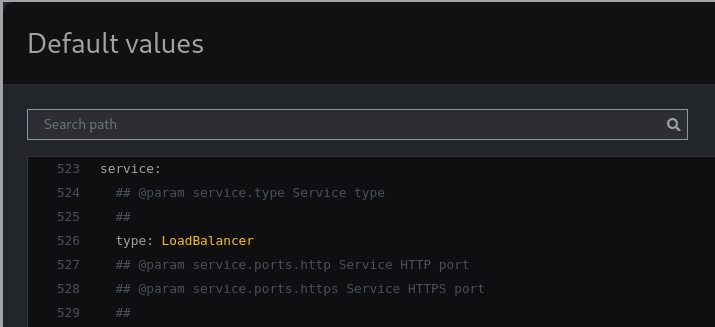

# Helm

As we see from the previous section, even for a very basic application, we begin to need many manifest files. For a large enterprise application this can grow enormously in which it becomes cumbersome to `kubectl create` (or `delete`) so many files. Similarly, we may need to create many of the same application but with different configurations. This is where `Helm` comes in.

## What is Helm

`Helm` is a package manager for Kubernetes applications. You can group together multiple Kubernetes manifests into one folder, and have a single `Helm` definition file describe the `chart` (packages in Helm are called `charts`). Also, Helm uses [Go's templating engine](https://pkg.go.dev/text/template) to make the underlying Kubernetes manifests more dynamic where you can use variables.

This can also be handy to separate chart maintainer from chart user. E.g. The chart maintainer can package up a bunch of k8s manifests that make up an application as a helm chart and only expose a few key parameters as variables. So the user won't have to dig through the manifests to change things, instead can just change the exposed parameter. This will make sense shortly when we create our own chart.

## Installation

First let's install Helm. It's best to follow their guide for your particular operating system: [here](https://helm.sh/docs/intro/install/).

We can test if the installation worked by checking the Helm version that was (hopefully) installed.

```bash
helm version
```

## `helm repo`

Helm uses the concept of a `repository` as somewhere which charts are stored. A very popular chart repository is managed by [Bitnami](https://artifacthub.io/packages/search?org=bitnami&sort=relevance&page=1). We can add their repository address to Helm using the command:

```bash
helm repo add bitnami https://charts.bitnami.com/bitnami
```

We now have access to a ton of pre-build charts of popular open-source applications packaged up as Helm charts, ready to be installed in our Kubernetes cluster.

## `helm install`

The command `helm install` will, as the name suggests, install an application into our cluster from a specified Helm chart. We'll stick with our basic nginx example. Luckily, Bitnami manage an Nginx chart ready to install. The command below tells `helm` to `install` a chart, name it `my-nginx` and get it from the `bitnami` repo, and from that repo, use the chart named `nginx`.

:::info Note

We're also using the flag `-n` (short for namespace, `--namespace` would also work) to tell Helm to install it in the `nginx` namespace. Now, this would error because we haven't create a namespace called `nginx`, so we also use the flag `--create-namespace` to tell Helm that if the namespace we specified doesn't exist then to create it first.

:::

```bash
helm install my-nginx bitnami/nginx -n nginx --create-namespace
```

We can list all charts that have been installed in the `nginx` namespace with the following command:

```bash
helm list -n nginx
```

Hopefully we should see something like this:

```
NAME            NAMESPACE       REVISION        UPDATED                                 STATUS          CHART           APP VERSION
my-nginx        nginx           1               2023-05-11 21:19:31.764271744 +0100 BST deployed        nginx-14.0.0    1.24.0
```

We can also use `kubectl` to see all the objects created using the following command:

```bash
kubectl get all -n nginx
```

Giving something like:

```
NAME                            READY   STATUS    RESTARTS   AGE
pod/my-nginx-74b4885cbf-86dvt   1/1     Running   0          13s

NAME               TYPE           CLUSTER-IP     EXTERNAL-IP   PORT(S)        AGE
service/my-nginx   LoadBalancer   10.96.79.211   <pending>     80:30874/TCP   13s

NAME                       READY   UP-TO-DATE   AVAILABLE   AGE
deployment.apps/my-nginx   1/1     1            1           13s

NAME                                  DESIRED   CURRENT   READY   AGE
replicaset.apps/my-nginx-74b4885cbf   1         1         1       13s
```

:::info Note

We can see the chart created a service of type `LoadBalancer`. But what if we would prefer type `ClusterIP` instead?

:::

## Values File

Helm uses a `values file` which overwrites the 'templated' values in the manifests (we'll see this in greater detail [when we create out own Helm chart](#helm-create)). Each chart comes with default values used for these templated variables, and if you don't do anything, they will be used. We can see the default values [here](https://artifacthub.io/packages/helm/bitnami/nginx?modal=values&path=service). There is **a lot** of lines here. These types of publicly available charts are very comprehensive to be maximally flexible for users. Though, the above link should take you to the exact section we're interested in. We can see that the default value for `service.type` is `LoadBalancer`.



Now the beauty of Helm is that we can chose to overwrite only what we want. So we can create a file called `values.yaml` and just add the two lines below:

```yaml title="values.yaml"
service:
  type: ClusterIP
```

And when using this with Helm, it will overwrite those specifically, and use the default values for everything else.

We can use the `helm upgrade` command to upgrade an already installed application using the form `helm upgrade <release-name> <repo-name>/<chart-name> --values <path-to-values-file>`:

```bash
helm upgrade my-nginx bitnami/nginx --values values.yaml -n nginx
```

:::info Note
We could have used the command below if we hadn't already installed this chart with name `my-nginx`.

`helm install my-nginx bitnami/nginx --values values.yaml -n nginx --create-namespace`

`install` is used for creating a new application. `upgrade` is for updating an already installed application.
:::
Now if we use the following command:

```bash
kubectl get service -n nginx
```

We should hopefully get something like:

```
NAME       TYPE        CLUSTER-IP     EXTERNAL-IP   PORT(S)   AGE
my-nginx   ClusterIP   10.96.79.211   <none>        80/TCP    38m
```

Great, our service has been updated to be of type `ClusterIP`, and this was done with a Helm values file; we didn't have to dig through the underlying kubernetes object definition manifest files that make up the application.

## `helm uninstall`

Before we learn how to create our own Helm chart we can clean up our previous installation with the following command:

```bash
helm uninstall my-nginx -n nginx
```

## `helm create`

```bash
helm create my-app
```

```
.
└── my-app
    ├── charts
    ├── Chart.yaml
    ├── templates
    │   ├── deployment.yaml
    │   ├── _helpers.tpl
    │   ├── hpa.yaml
    │   ├── ingress.yaml
    │   ├── NOTES.txt
    │   ├── serviceaccount.yaml
    │   ├── service.yaml
    │   └── tests
    │       └── test-connection.yaml
    └── values.yaml
```

```
.
└── my-app
    ├── charts
    ├── Chart.yaml
    └── templates
```
